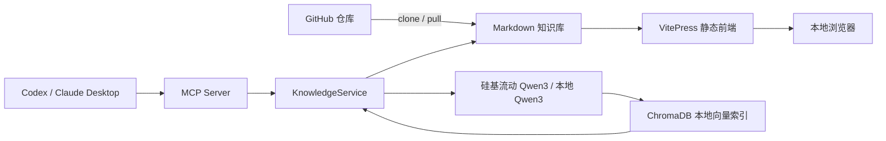

# Android Knowledge Base · RAG · MCP

一个面向 Android 学习、面试复习和知识维护的本地优先知识库项目。

项目使用 Markdown 保存知识内容，通过 VitePress 提供可搜索的文档网站，通过 ChromaDB 和嵌入模型提供语义检索，并通过 MCP Server 接入 Codex、Claude Desktop 等 AI 客户端，实现知识库的检索、创建、更新和删除。

## 主要能力

- 使用 VitePress 浏览 Markdown 知识库，支持侧边栏、全文搜索、深色模式和开发时热更新。
- 使用 ChromaDB 保存本地向量索引，向量数据可以随时由 Markdown 重建。
- 推荐通过硅基流动在线调用国产 `Qwen/Qwen3-Embedding-0.6B`，降低本机内存占用和首次索引时间。
- 可选在本地运行同一 Qwen3 模型，满足离线使用需求。
- 提供 MCP tools 和 resources，供 AI 客户端按需检索和安全编辑知识库。
- 支持全量重建索引、指定目录导入、元数据过滤、标签过滤和余弦相似度搜索。
- 文档写入与向量更新具备一致性保护；更新失败时会尽可能恢复原文件和原索引。

## 系统架构



项目遵循以下数据原则：

- `knowledge-base/` 中的 Markdown 是知识库的事实来源，应提交到 Git。
- `.chroma/` 是本地派生索引，不提交到 Git；克隆仓库或拉取更新后可以重新生成。
- `.model-cache/`、`.venv/`、`node_modules/` 均为本地依赖或缓存，不提交到 Git。
- `.env` 保存本机配置或密钥，不提交到 Git；仓库只提供 `.env.example`。
- VitePress 页面搜索与 RAG 向量检索是两套独立能力：浏览前端不要求先生成向量。

## 技术栈

| 模块 | 技术 |
|---|---|
| 文档与前端 | Markdown、VitePress、Vue |
| MCP Server | Python、MCP Python SDK |
| 向量数据库 | ChromaDB |
| 推荐嵌入服务 | 硅基流动 OpenAI 兼容接口 |
| 嵌入模型 | `Qwen/Qwen3-Embedding-0.6B`，1024 维 |
| 离线备选 | Sentence Transformers 本地 Qwen3 |
| AI 客户端 | Codex、Claude Desktop 或其他 MCP 客户端 |

## 环境要求

- Git
- Node.js 18 或更高版本
- npm
- Python 3.10 或更高版本，推荐 Python 3.12
- 使用在线嵌入服务时需要访问硅基流动 API
- 仅启用本地模型时需要访问模型仓库，并预留数 GB 磁盘和运行内存

本项目主要在 macOS 上使用和验证。Linux、Windows 可根据本机 Python、PyTorch 和 MCP 客户端的路径规则调整命令；`LOCAL_EMBEDDING_DEVICE=auto` 会依次选择可用的 MPS、CUDA 或 CPU。

## 快速开始

### 1. 克隆仓库

```bash
git clone https://github.com/timeisthe/android-knowledge-base-rag-mcp.git
cd android-knowledge-base-rag-mcp
```

后续命令默认都在仓库根目录执行。

### 2. 仅启动知识库网站

如果只需要阅读和编辑 Markdown，不需要 RAG 或 MCP：

```bash
npm ci --cache ./work/npm-cache
npm run docs:dev -- --open
```

开发服务器默认地址：

```text
http://localhost:5173/
```

修改 `knowledge-base/` 中的 Markdown 后，页面会自动刷新。停止服务器时按 `Control + C`。

如果默认端口被占用：

```bash
npm run docs:dev -- --port 5174 --open
```

### 3. 安装 RAG 和 MCP 环境

创建 Python 虚拟环境：

```bash
python3.12 -m venv .venv
source .venv/bin/activate
```

如果本机命令名不是 `python3.12`，可以使用满足版本要求的 `python3`。Windows PowerShell 使用：

```powershell
py -3.12 -m venv .venv
.\.venv\Scripts\Activate.ps1
```

安装 MCP Server 和开发依赖：

```bash
python -m pip install --upgrade pip
python -m pip install -e './mcp-server[dev]'
```

只有需要离线运行本地模型时，才安装额外依赖：

```bash
python -m pip install -e './mcp-server[dev,local-models]'
```

确认 CLI 已安装：

```bash
android-kb-mcp --help
```

### 4. 创建本地配置

macOS 或 Linux：

```bash
cp .env.example .env
```

Windows PowerShell：

```powershell
Copy-Item .env.example .env
```

推荐使用硅基流动在线运行国产 Qwen3 Embedding。创建 API Key 后，将完整密钥写入 `EMBEDDING_API_KEY`：

```dotenv
EMBEDDING_PROVIDER=openai
EMBEDDING_API_KEY=<YOUR_SILICONFLOW_API_KEY>
OPENAI_BASE_URL=https://api.siliconflow.cn/v1
OPENAI_EMBEDDING_MODEL=Qwen/Qwen3-Embedding-0.6B
OPENAI_EMBEDDING_DIMENSIONS=1024
OPENAI_EMBEDDING_BATCH_SIZE=8
OPENAI_TIMEOUT_SECONDS=30
OPENAI_MAX_RETRIES=4

KNOWLEDGE_BASE_PATH=knowledge-base
CHROMA_PERSIST_PATH=.chroma
CHROMA_COLLECTION=android_knowledge_siliconflow_qwen3_06b_1024_v1
MCP_TRANSPORT=stdio
```

`EMBEDDING_API_KEY` 优先于兼容旧配置的 `OPENAI_API_KEY`，可以避免宿主环境中已有的 OpenAI Key 覆盖项目密钥。`.env` 已被 `.gitignore` 排除；不要在聊天、日志或 Git 提交中暴露 API Key。

### 5. 建立向量索引

```bash
android-kb-mcp reindex
```

在线模式不会在本机下载或加载模型。命令将：

1. 扫描 `knowledge-base/` 下的知识文档；
2. 解析 Markdown frontmatter、标题、标签和正文；
3. 生成文档向量；
4. 将向量和元数据写入 `.chroma/`；
5. 删除已经没有对应 Markdown 文件的陈旧向量。

检查文档与索引数量：

```bash
android-kb-mcp metadata
```

执行一次语义搜索：

```bash
android-kb-mcp search "Activity 配置变更" --top-k 3
```

## 拉取更新与重新向量化

GitHub 只同步 Markdown 和程序源码，不同步 `.chroma/`。从远程仓库拉取知识库更新后，推荐执行：

```bash
git pull --rebase
source .venv/bin/activate
android-kb-mcp reindex
android-kb-mcp metadata
```

Windows PowerShell 将激活命令替换为：

```powershell
.\.venv\Scripts\Activate.ps1
```

`reindex` 是当前项目最可靠的同步方式。它会重新计算当前全部知识文档的向量，并清理被删除或重命名文档留下的旧向量。

不同修改方式对应的处理策略如下：

| 修改方式 | 是否需要手动向量化 | 推荐操作 |
|---|---:|---|
| 手动新增或修改 Markdown | 是 | 执行 `android-kb-mcp reindex` |
| `git pull` 拉取他人更新 | 是 | 拉取后执行 `reindex` |
| 手动删除或重命名 Markdown | 是 | 执行 `reindex`，同时清理陈旧向量 |
| MCP `create_document` | 否 | Server 自动写入对应向量 |
| MCP `update_document` | 否 | Server 自动重建对应向量 |
| MCP `append_to_section` | 否 | Server 自动重建对应向量 |
| MCP `delete_document` | 否 | Server 自动删除对应向量 |
| 修改嵌入模型或向量维度 | 是 | 使用新的 Collection 并执行 `reindex` |

如果确认某个目录中只有新增或修改，没有删除或重命名，可以只导入该目录：

```bash
android-kb-mcp ingest kotlin
```

该命令会重新向量化 `knowledge-base/kotlin/`，但不会清理目录外或已删除文件的陈旧向量。因此多人协作或不确定改动范围时，优先使用 `reindex`。

## 本地前端与静态构建

启动开发服务器：

```bash
npm run docs:dev -- --open
```

生成生产版本：

```bash
npm run docs:build
```

构建产物位于：

```text
knowledge-base/.vitepress/dist/
```

预览生产构建：

```bash
npm run docs:preview -- --open
```

前端由 VitePress 直接读取 Markdown。即使尚未安装 Python、下载嵌入模型或生成 `.chroma/`，也可以正常浏览网站和使用 VitePress 的本地全文搜索。

### 部署到 GitHub Pages

当前仓库提供 VitePress 静态构建能力，但没有预设 GitHub Pages 工作流。部署到 GitHub Pages 时需要额外配置：

- GitHub Actions 构建与发布流程；
- 项目站点使用的 VitePress `base` 路径；
- Repository Settings 中的 Pages 发布来源。

GitHub Pages 只能托管静态前端，不能运行本项目的 Python MCP Server、嵌入模型或 ChromaDB。RAG 和 MCP 默认仍在使用者本机运行。

## 接入 MCP 客户端

MCP 客户端通常通过 `stdio` 自动启动 Server。正常使用时不需要单独运行常驻服务。

### 1. 获取仓库绝对路径

macOS 或 Linux：

```bash
pwd
```

Windows PowerShell：

```powershell
(Get-Location).Path
```

### 2. 使用仓库内配置模板

- Codex：[mcp-server/examples/codex-config.toml](./mcp-server/examples/codex-config.toml)
- Claude Desktop：[mcp-server/examples/claude_desktop_config.json](./mcp-server/examples/claude_desktop_config.json)

将模板中的 `/ABSOLUTE/PATH/TO/REPOSITORY` 全部替换为仓库真实绝对路径，然后合并到对应客户端配置中。

配置中的关键要求：

- `command` 必须指向当前仓库虚拟环境中的 Python；
- `cwd` 必须是仓库根目录；
- `KNOWLEDGE_BASE_PATH`、`CHROMA_PERSIST_PATH` 和模型缓存路径建议使用绝对路径；
- MCP 客户端使用的模型和 Collection 应与创建索引时的 `.env` 保持一致；
- 保存配置后需要完全退出并重新启动 MCP 客户端。

配置完成后，可以让客户端调用 `search_knowledge` 验证连接。

手动诊断 Server：

```bash
android-kb-mcp serve
```

`stdio` Server 启动后会等待客户端消息，终端没有持续输出属于正常现象。按 `Control + C` 停止。正常由 MCP 客户端启动时，不要同时运行另一个手动 Server。

## MCP 能力

### Tools

| Tool | 作用 |
|---|---|
| `search_knowledge` | 语义搜索并返回相关文档摘要 |
| `get_document` | 读取单篇完整 Markdown |
| `create_document` | 创建文档并自动生成向量 |
| `update_document` | 更新文档并自动重建向量 |
| `delete_document` | 删除文档和对应向量 |
| `append_to_section` | 向指定 Markdown 章节追加内容 |
| `list_documents` | 按分类、难度、标题或标签列出文档元数据 |
| `bulk_ingest` | 批量导入指定目录 |
| `reindex_all` | 全量校准 Markdown 和向量索引 |

### Resources

| URI | 内容 |
|---|---|
| `knowledge://metadata` | 文档数量、索引数量、分类和难度统计 |
| `knowledge://tags` | 知识库全部标签 |
| `knowledge://documents/{category}` | 指定分类下的文档元数据 |
| `knowledge://document/{file_path}` | 指定文档的完整内容 |

完整参数、过滤器和 AI 编辑示例见 [USAGE.md](./USAGE.md)。

## CLI 命令

| 命令 | 作用 |
|---|---|
| `android-kb-mcp serve` | 启动 MCP Server |
| `android-kb-mcp ingest [directory]` | 向量化指定目录 |
| `android-kb-mcp reindex` | 全量同步 Markdown 与 ChromaDB |
| `android-kb-mcp metadata` | 输出文档和索引统计 |
| `android-kb-mcp search QUERY` | 执行语义搜索 |

如果没有激活虚拟环境，macOS 或 Linux 可以直接使用：

```bash
.venv/bin/android-kb-mcp --help
```

## 嵌入模型配置

### 推荐：硅基流动在线 Qwen3

```dotenv
EMBEDDING_PROVIDER=openai
EMBEDDING_API_KEY=<YOUR_SILICONFLOW_API_KEY>
OPENAI_BASE_URL=https://api.siliconflow.cn/v1
OPENAI_EMBEDDING_MODEL=Qwen/Qwen3-Embedding-0.6B
OPENAI_EMBEDDING_DIMENSIONS=1024
OPENAI_EMBEDDING_BATCH_SIZE=8
OPENAI_TIMEOUT_SECONDS=30
OPENAI_MAX_RETRIES=4
OPENAI_EMBEDDING_QUERY_INSTRUCTION=
CHROMA_COLLECTION=android_knowledge_siliconflow_qwen3_06b_1024_v1
```

远端请求会按照 `OPENAI_EMBEDDING_BATCH_SIZE` 分批提交。OpenAI SDK 会对限流和临时服务错误执行指数退避重试；空的 `OPENAI_EMBEDDING_QUERY_INSTRUCTION` 会复用本地 Qwen 查询指令配置。

这里的 `EMBEDDING_PROVIDER=openai` 表示使用 OpenAI 兼容协议，实际服务和模型仍分别来自国内的硅基流动与 Qwen。

### 备选：Qwen3 本地模型

```dotenv
EMBEDDING_PROVIDER=sentence-transformers
LOCAL_EMBEDDING_MODEL=Qwen/Qwen3-Embedding-0.6B
LOCAL_EMBEDDING_CACHE_PATH=.model-cache/huggingface
LOCAL_EMBEDDING_DEVICE=auto
LOCAL_EMBEDDING_BATCH_SIZE=8
LOCAL_EMBEDDING_QUERY_INSTRUCTION=Given an Android technical interview question, retrieve relevant knowledge-base documents that answer the question
HF_HUB_OFFLINE=0
TRANSFORMERS_OFFLINE=0
CHROMA_COLLECTION=android_knowledge_local_qwen3_06b_1024_v1
```

首次运行会下载模型。如果内存不足，可以降低批量大小或强制使用 CPU：

```dotenv
LOCAL_EMBEDDING_BATCH_SIZE=2
LOCAL_EMBEDDING_DEVICE=cpu
```

模型下载完成后如需完全离线加载：

```dotenv
HF_HUB_OFFLINE=1
TRANSFORMERS_OFFLINE=1
```

修改 Provider、模型或向量维度后，必须使用新的 Chroma Collection 或清理旧索引，再执行：

```bash
android-kb-mcp reindex
```

查询向量和文档向量必须来自相同模型和相同维度。不同模型生成的向量不能放入同一个 Collection。

通过 MCP 调用 `create_document`、`update_document` 或 `append_to_section` 时，只会重新向量化目标文档；`delete_document` 会同步删除对应向量。如果向量操作失败，文档修改会回滚。直接编辑 Markdown、执行 `git pull` 或手动重命名文件不会触发 MCP，需要运行 `android-kb-mcp reindex`。

## 知识文档约定

知识文档位于 `knowledge-base/`，使用 Markdown 和 YAML frontmatter：

```markdown
---
title: Activity 生命周期
tags: [Android, Framework, 高频]
difficulty: medium
category: android-framework
subcategory: four-components
---

# Activity 生命周期

## 概述

正文内容。

## 参考资料

- [Android Developers](https://developer.android.com/)
```

### 内容分层约定

知识库采用“速览层 + 深挖层”，避免八股页面既过长又缺少细节：

- 速览层：位于 `knowledge-base/八股/` 和面试总结目录，保留高频结论、回答骨架和关键边界，适合快速复习。
- 深挖层：位于对应技术分类目录，例如 `android-framework/view-system/`，展开角色关系、内部状态、源码链路、具体实现和容易误解的边界。
- 速览中的可扩展主题应使用 `kb-deep-link` 卡片跳转到深挖文章；深挖文章顶部应提供返回速览的链接。

深挖文章默认覆盖：

1. 类或模块在系统中的角色，以及和其他对象的关系。
2. 关键字段、状态、初始化逻辑和生命周期。
3. 核心方法的输入、处理流程、状态变化和输出。
4. 可运行或接近可运行的代码实现。
5. 常见误解、失败场景和版本边界。
6. 当前官方文档与源码参考。

速览页中的跳转卡片示例：

```html
<a class="kb-deep-link" href="/android-framework/view-system/view-event-dispatch#view-event-dispatch-deep-dive" target="_self">
  <span class="kb-deep-link__eyebrow">深入阅读 · 原理与源码</span>
  <strong>View 事件分发、触摸目标与滑动冲突</strong>
  <span>查看完整调用链、内部状态和具体实现。</span>
</a>
```

索引文本由标题、标签和正文共同组成。`index.md` 和 `.vitepress/` 下的文件不会作为 RAG 知识文档写入 ChromaDB。

## 项目结构

```text
.
├── knowledge-base/
│   ├── .vitepress/                 # VitePress 配置、主题和侧边栏
│   ├── index.md                    # 知识库首页
│   └── **/*.md                     # 知识文档
├── mcp-server/
│   ├── src/android_kb_mcp/         # Repository、RAG、ChromaDB 和 MCP
│   ├── tests/                      # Python 测试
│   └── examples/                   # MCP 客户端配置模板
├── .env.example                    # 环境变量模板
├── package.json                    # VitePress 脚本与依赖
├── USAGE.md                        # MCP 使用指南
├── COSTS.md                        # 嵌入成本与规模建议
└── README.md                       # 项目入口文档
```

## 开发与验证

安装开发依赖后运行 Python 测试：

```bash
python -m pytest mcp-server/tests
```

构建前端：

```bash
npm run docs:build
```

完整的本地验收流程：

```bash
npm run docs:build
python -m pytest mcp-server/tests
android-kb-mcp reindex
android-kb-mcp metadata
android-kb-mcp search "Activity 生命周期" --top-k 3
```

测试覆盖文档路径安全、CRUD、过滤、章节追加、失败回滚、陈旧向量清理、ChromaDB 读写、嵌入参数和 MCP 注册契约。

## 常见问题

### `android-kb-mcp: command not found`

确认已经激活虚拟环境：

```bash
source .venv/bin/activate
android-kb-mcp --help
```

或者直接使用 `.venv/bin/android-kb-mcp`。

### 提示缺少 `sentence-transformers` 或 `torch`

只有本地模型模式需要这些依赖：

```bash
source .venv/bin/activate
python -m pip install -e './mcp-server[dev,local-models]'
```

### 硅基流动返回 `401 Token is invalid`

确认 `.env` 使用完整的 Secret Key，并优先配置专用变量：

```dotenv
EMBEDDING_API_KEY=sk-完整密钥
```

不要把密钥 ID、已撤销的 Key 或页面中的掩码文本当成 Secret Key。修改 `.env` 后需要完全重启 MCP 客户端。

### Qwen3 在 MPS 上内存不足

在 `.env` 中降低批量大小：

```dotenv
LOCAL_EMBEDDING_BATCH_SIZE=2
```

仍然失败时切换为 CPU：

```dotenv
LOCAL_EMBEDDING_DEVICE=cpu
```

### 切换模型后提示向量维度不一致

推荐为新模型设置新的 `CHROMA_COLLECTION`。也可以先备份本地索引再重建：

```bash
mv .chroma ".chroma.backup.$(date +%Y%m%d-%H%M%S)"
android-kb-mcp reindex
```

`.chroma` 只是派生索引，不会影响 Markdown 原文。

### MCP 客户端无法发现 Server

依次检查：

1. `command` 是否指向当前仓库的虚拟环境 Python；
2. `cwd` 和各数据路径是否为真实绝对路径；
3. TOML 或 JSON 配置语法是否有效；
4. MCP 客户端配置是否与 `.env` 使用相同模型和 Collection；
5. 保存配置后是否完全重启客户端；
6. 手动运行 `android-kb-mcp serve` 是否立即报错。

## 安全与版本控制

提交前运行：

```bash
git status
```

确认以下内容没有进入提交：

```text
.env
.chroma/
.model-cache/
.venv/
node_modules/
knowledge-base/.vitepress/cache/
knowledge-base/.vitepress/dist/
```

如果密钥曾经被提交，即使之后删除文件，也应立即在服务提供商处撤销并重新生成密钥；仅创建一个删除提交不能从 Git 历史中移除旧密钥。

公开仓库前还应检查知识文档中的个人信息、内部资料以及第三方内容的转载和授权情况。

## 其他文档

- [USAGE.md](./USAGE.md)：MCP tools、resources、过滤器和 AI 编辑示例。
- [COSTS.md](./COSTS.md)：硅基流动在线嵌入、本地模型备选、费用触发点和规模增长建议。
- [mcp-server/README.md](./mcp-server/README.md)：Python MCP Server 独立开发指南。

## 许可证

本项目采用双许可证，许可证范围按文件类型区分：

- 程序源码、前端实现、MCP Server 和项目配置采用 [MIT License](./LICENSE)。
- `knowledge-base/` 中的原创文章、说明文字、原创图表和原创图片采用 [CC BY-SA 4.0](./knowledge-base/LICENSE.md)。

第三方引用、外部链接、商标以及明确标注其他权利归属的内容不因本项目许可证而获得重新许可，仍遵循其原始授权条款。
