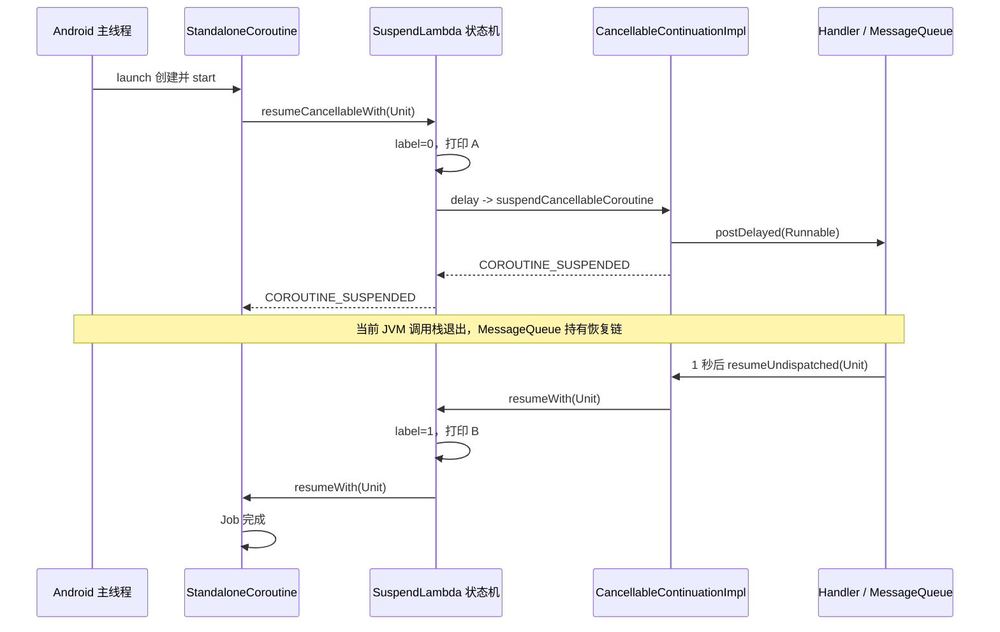

<span id="kotlin-coroutine-deep-dive" class="kb-anchor-offset"></span>

# Kotlin 协程为什么出现，以及挂起、恢复与取消的源码链路

> 本文是协程的深挖层：先重建同步、线程和回调方案，再沿一条可验证的 Android 链路解释协程如何启动、挂起、被外部事件持有、恢复和取消。只想复习进程、线程与协程的关系时，可返回 <a href="/computer-science/concurrency/process-thread-coroutine#coroutine-overview" target="_self">进程、线程与协程总览</a>。

## 1. 一句话结论

Kotlin 协程没有替代线程、网络库、Android `Looper` 或操作系统调度。它把原本由开发者手写的回调续体、错误传播、任务组合、线程调度入口和生命周期取消，统一成了“顺序代码 + 状态机 + `Continuation` + `CoroutineContext` + `Job`”这一套结构化模型。

可以把 Android 异步编程的演化路线概括为：

```text
同步代码
    ↓ 主线程会被耗时操作阻塞
线程 + 回调
    ↓ 不再阻塞主线程，但控制流程、错误和取消开始分散
Future / Promise / RxJava
    ↓ 改善任务组合，但引入另一套组合与调度抽象
协程
    ↓ 保留异步能力，同时恢复接近顺序代码的表达方式
```

协程主要解决的是：

> 异步任务的控制流程、错误处理、任务组合、取消和生命周期管理过于分散。

它不承诺让网络更快，也不承诺让阻塞函数自动变成非阻塞函数。

## 2. 真实问题：顺序业务很清楚，执行约束却不允许直接顺序调用

假设页面刷新需要完成：

```text
请求用户信息
-> 根据用户 id 请求订单
-> 保存订单
-> 更新界面
```

最符合业务思维的代码是：

```kotlin
fun refresh() {
    val user = api.getUserSync()
    val orders = api.getOrdersSync(user.id)
    dao.saveOrders(orders)
    render(orders)
}
```

这段代码的控制流没有问题，问题在于 Android 主线程还要处理输入、生命周期、布局和绘制。如果网络和数据库调用直接占住主线程，后续消息无法及时处理，页面会卡顿，严重时触发 ANR。

真正的约束不是“顺序代码不好”，而是：

```text
业务步骤存在先后依赖
+ 耗时步骤不能占住主线程
+ 最终 UI 操作必须在主线程执行
+ 页面销毁后无意义的任务应停止
```

## 3. 传统方案一：线程池承载阻塞任务

### 3.1 最小实现

```kotlin
fun refresh() {
    executor.execute {
        try {
            val user = api.getUserSync()
            val orders = api.getOrdersSync(user.id)
            dao.saveOrders(orders)

            mainHandler.post {
                render(orders)
            }
        } catch (error: IOException) {
            mainHandler.post {
                showError(error)
            }
        }
    }
}
```

这套方案已经正确解决了一个重要问题：耗时调用不再占用 Android 主线程。不能把它描述成“错误做法”，因为协程执行阻塞 I/O 时，底层仍然可能使用线程池。

### 3.2 谁承担了哪些责任

| 责任 | 传统方案中的承担者 |
|---|---|
| 执行业务任务 | `Executor` 中的工作线程 |
| 等待同步网络和数据库结果 | 当前工作线程，等待期间仍被占用 |
| 保存后续步骤和局部变量 | 工作线程的 JVM 调用栈与闭包 |
| 通知 UI 更新 | `mainHandler.post` 中的 `Runnable` |
| 切回主线程 | 开发者显式调用 `Handler` |
| 传播错误 | 后台线程中的 `try/catch`，再手动投递给主线程 |
| 取消 | 保存 `Future`、网络 `Call` 等句柄后逐个取消 |
| 生命周期管理 | Activity、Fragment 或 ViewModel 自己维护句柄集合 |

当任务数量增大时，开发者必须持续回答：

- 当前代码运行在哪个线程？
- 这个阻塞调用会占用线程多久？
- 结果应投递到哪个线程？
- 页面销毁时要取消哪些句柄？
- 取消了外层任务，底层网络或数据库操作是否真的停止？
- 后台异常如何回到统一的 UI 状态？

此外，如果底层全部是阻塞式 API，每个等待中的任务通常都要占用一个工作线程。线程池只是把等待从主线程搬到了后台线程，并没有消除等待对线程的占用。

## 4. 传统方案二：异步 API 与回调

### 4.1 最小可重建链路

```kotlin
fun refresh() {
    fun postError(error: Throwable) {
        mainHandler.post { showError(error) }
    }

    api.getUser(object : Callback<User> {
        override fun onSuccess(user: User) {
            api.getOrders(user.id, object : Callback<List<Order>> {
                override fun onSuccess(orders: List<Order>) {
                    dao.saveOrders(
                        orders = orders,
                        onSuccess = {
                            mainHandler.post { render(orders) }
                        },
                        onFailure = ::postError
                    )
                }

                override fun onFailure(error: Throwable) {
                    postError(error)
                }
            })
        }

        override fun onFailure(error: Throwable) {
            postError(error)
        }
    })
}
```

如果网络库使用真正的异步 I/O，请求等待期间不需要让调用线程一直阻塞。异步完成后，网络库调用保存好的回调，业务再进入下一步。

一次等待可以按时间线重建为：

```text
1. 主线程调用 api.getUser(callback)。
2. 网络库保存 callback，并把请求交给自己的线程或事件机制。
3. api.getUser 立即返回，主线程继续处理消息。
4. 网络结果到达后，网络库调用 callback.onSuccess(user)。
5. callback 保存了“拿到 user 后做什么”，因此可以继续请求订单。
6. 最终结果再通过 Handler 或框架约定回到主线程。
```

这里，回调对象本质上就是“未来如何继续执行”的显式表示。

### 4.2 回调方案扩展后的具体痛点

#### 控制流程被拆散

顺序逻辑：

```text
getUser -> getOrders -> save -> render
```

回调逻辑：

```text
注册 getUser 回调
-> 未来进入回调
-> 再注册 getOrders 回调
-> 未来进入回调
-> 再注册 save 回调
```

业务顺序仍然存在，但被拆到多个未来回调中。开发者不再直接执行下一句，而是把“下一步做什么”交给框架保存并在未来调用，这就是控制反转。

#### 错误处理分散

每个异步边界都有独立的失败出口。要实现“任一步失败都进入同一错误状态”，就要在多层回调中重复转发错误，或者自己再构建一套结果封装。

#### 取消句柄分散

页面销毁时，可能同时存在用户请求、订单请求、数据库任务、Handler `Runnable`。外层调用已经返回，局部调用栈也已消失，因此必须把这些句柄保存为字段，并处理“完成与取消同时发生”的竞争。

#### 线程切换分散

代码中可能同时出现：

```text
executor.execute
handler.post
runOnUiThread
网络库自带回调线程
数据库框架自带执行器
```

线程规则成为每一层调用者都要记住的隐式契约。

## 5. Future、Promise 与 RxJava 改善了什么，又留下了什么

`Future`、`CompletableFuture`、Promise 和 RxJava 并不是无效的过渡方案。它们把“未来结果”变成对象，并提供组合、错误传播、线程切换或取消能力。

例如 RxJava 可以把链路写成：

```kotlin
api.getUser()
    .flatMap { user -> api.getOrders(user.id) }
    .flatMap { orders ->
        dao.saveOrders(orders)
            .andThen(Single.just(orders))
    }
    .subscribeOn(Schedulers.io())
    .observeOn(AndroidSchedulers.mainThread())
    .subscribe(::render, ::showError)
```

它解决了嵌套回调和组合问题，但业务流程要通过操作符、订阅和调度器表达。开发者还要管理 `Disposable`，并理解冷流、热流、背压、错误终止和线程切换等额外语义。

协程没有证明这些抽象“错误”，而是选择了另一种表达方式：让挂起函数直接返回结果或抛出异常，由编译器和运行时保存后续执行状态。

## 6. 协程如何重新分配旧方案中的责任

同一业务使用协程可以写成：

```kotlin
class UserViewModel(
    private val repository: UserRepository
) : ViewModel() {

    private val _uiState = MutableStateFlow<UserUiState>(UserUiState.Idle)
    val uiState: StateFlow<UserUiState> = _uiState.asStateFlow()

    fun refresh() {
        viewModelScope.launch {
            try {
                val orders = repository.refreshOrders()
                _uiState.value = UserUiState.Success(orders)
            } catch (error: IOException) {
                _uiState.value = UserUiState.Error(error)
            }
        }
    }
}

class UserRepository(
    private val api: UserApi,
    private val dao: OrderDao,
    private val ioDispatcher: CoroutineDispatcher
) {
    suspend fun refreshOrders(): List<Order> {
        val user = api.getUser()
        val orders = api.getOrders(user.id)

        withContext(ioDispatcher) {
            dao.saveOrdersBlocking(orders)
        }

        return orders
    }
}
```

这里假设 Retrofit 的 `suspend` 网络接口本身是主线程安全的，而阻塞式 DAO 由真正执行阻塞操作的 Repository 切到注入的 I/O Dispatcher。ViewModel 只负责启动协程和更新可观察状态，不直接持有 View；调用者也不需要重复知道底层线程细节。

新旧责任可以直接映射：

| 旧责任 | 协程中的承接方式 | 解决的问题 |
|---|---|---|
| 成功回调中保存后续步骤 | 编译器生成的 `Continuation` 状态机 | 重新使用顺序语法表达异步控制流 |
| 每层失败回调 | 挂起函数通过 `Result` 恢复并在调用处抛出 | 让异常沿顺序调用链传播，可集中 `try/catch` |
| `Executor`、`Handler` 手动切换 | `CoroutineDispatcher`、`withContext` | 把执行位置放入上下文并集中管理 |
| 保存并逐个取消异步句柄 | `Job` 父子关系与可取消挂起点 | 让取消沿任务树传播 |
| Activity/Fragment 自建任务集合 | `viewModelScope`、`lifecycleScope` | 把任务生命周期绑定到明确所有者 |
| 多任务完成计数与嵌套回调 | `coroutineScope`、`async/await` | 让并发子任务仍属于同一个结构 |
| 将一次回调 API 转成顺序返回 | `suspendCancellableCoroutine` | 把外部完成通知接入协程恢复协议 |

责任边界必须同时记住：

```text
协程负责：控制流表达、状态保存、调度入口、结构化取消与异常传播。
线程/Looper/网络库负责：真正执行指令、等待系统事件、产生完成通知。
开发者负责：选择作用域和 Dispatcher、避免共享状态竞态、正确接入取消。
```

## 7. 深入源码前，先把例子缩小到一条可验证链路

网络请求会同时引入 Retrofit、OkHttp 和 Socket 事件机制。为了只观察协程本身，下面把“等待外部结果”缩小为 `delay`：

```kotlin
viewModelScope.launch {
    println("A")
    delay(1_000)
    println("B")
}
```

表面时间线是：

```text
主线程启动协程
-> 打印 A
-> delay 注册 1 秒后的恢复动作
-> 当前调用栈退出，主线程继续运行 Looper
-> 1 秒后 Handler 收到消息
-> 状态机从 delay 后继续
-> 打印 B
-> Job 完成
```

以下源码名称和伪代码以这些版本为参照：

```text
kotlinx.coroutines 1.10.2
AndroidX Lifecycle 2.10.0
Kotlin stdlib 2.2.21
```

相邻版本可能调整内部字段、优化分支和文件位置，但“状态机保存位置、`Continuation` 表示后续、Dispatcher 决定恢复执行位置、Job 管理生命周期”的主链路不会因此改变。

## 8. 先区分四个容易混淆的对象

源码中不是“只有一个 Continuation”，而是多个对象按职责形成包装和完成链：

| 对象 | 谁创建 | 关键状态或依赖 | 在链路中的角色 |
|---|---|---|---|
| `StandaloneCoroutine` | `launch` | `CoroutineContext`、Job 状态、父 Job 句柄 | 当前 `launch` 的 Job、Scope 与最终完成接收者 |
| 编译器生成的 `SuspendLambda` | Kotlin 编译器生成类，启动时创建实例 | `label`、跨挂起点局部变量、`completion` | 保存整段业务代码执行到了哪里 |
| `DispatchedContinuation` | `ContinuationInterceptor.interceptContinuation` | `dispatcher`、被包装的 continuation、待恢复结果 | 恢复前判断是否需要调度到目标线程 |
| `CancellableContinuationImpl` | `suspendCancellableCoroutine` | delegate、完成结果、挂起/恢复决策、父 Job 取消句柄 | 表示当前正在等待的一个具体异步事件 |

两个关键区别：

1. `SuspendLambda` 保存的是整个挂起 lambda 的业务状态；`CancellableContinuationImpl` 表示的是当前某一个等待点。
2. `StandaloneCoroutine` 不是业务状态机本身。它接收业务状态机的最终成功或失败，并维护 Job 生命周期。

## 9. 第一阶段：获得 viewModelScope

AndroidX 默认 ViewModel scope 的创建逻辑可以概括为：

```kotlin
internal fun createViewModelScope(): CloseableCoroutineScope {
    val dispatcher = Dispatchers.Main.immediate
    return CloseableCoroutineScope(
        coroutineContext = SupervisorJob() + dispatcher
    )
}
```

因此默认 `viewModelScope` 至少包含：

```text
SupervisorJob
+ Dispatchers.Main.immediate
```

它们分别解决：

- `SupervisorJob`：建立任务所有权；一个直接子协程失败不会自动取消其他兄弟协程，但失败仍需被正确处理。
- `Main.immediate`：默认在 Android 主线程运行；如果恢复时已经位于主线程，可直接执行而不额外 `Handler.post`。
- `CloseableCoroutineScope`：当 ViewModel 被清理时取消 scope 中的 Job。

此时还没有创建当前业务协程。`viewModelScope` 只是提供父 Job 和默认调度器。

## 10. 第二阶段：launch 合并上下文并创建 StandaloneCoroutine

`launch` 的核心结构可以简化为：

```kotlin
public fun CoroutineScope.launch(
    context: CoroutineContext = EmptyCoroutineContext,
    start: CoroutineStart = CoroutineStart.DEFAULT,
    block: suspend CoroutineScope.() -> Unit
): Job {
    val newContext = newCoroutineContext(context)

    val coroutine = if (start.isLazy) {
        LazyStandaloneCoroutine(newContext, block)
    } else {
        StandaloneCoroutine(newContext, active = true)
    }

    coroutine.start(start, coroutine, block)
    return coroutine
}
```

### 10.1 newCoroutineContext 合并什么

`newCoroutineContext(context)` 把 scope 原有上下文与调用者传入的上下文组合起来。当前例子没有额外参数，因此调度器仍是 `Main.immediate`，父 Job 来自 `viewModelScope`。

新协程自己的 Job 不是简单地作为一个普通 `Job` 元素与父 Job 并列相加；`StandaloneCoroutine` 本身实现 `Job`，并在构造阶段读取父上下文的 Job，建立父子关系。

### 10.2 StandaloneCoroutine 为什么能同时扮演多个角色

它继承自 `AbstractCoroutine<Unit>`。`AbstractCoroutine` 同时实现：

```text
Job
Continuation<T>
CoroutineScope
```

所以同一个对象具有三种接口视角：

- 作为 `Job`：可被取消、等待和查询状态。
- 作为 `CoroutineScope`：向业务 block 暴露当前 `coroutineContext`。
- 作为 `Continuation<Unit>`：接收业务状态机最终返回的 `Unit` 或异常。

### 10.3 父子 Job 关系何时建立

`AbstractCoroutine` 初始化时会根据父上下文执行类似：

```kotlin
initParentJob(parentContext[Job])
```

形成：

```text
viewModelScope 的 SupervisorJob
└── 当前 StandaloneCoroutine
```

因此 ViewModel 清理时，父 Job 能找到并取消当前 `launch`。

## 11. 第三阶段：CoroutineStart.DEFAULT 启动业务 block

`launch` 随后执行：

```kotlin
coroutine.start(start, coroutine, block)
```

默认 `CoroutineStart.DEFAULT` 最终走向：

```kotlin
block.startCoroutineCancellable(
    receiver = coroutine,
    completion = coroutine
)
```

这里的两个 `coroutine` 视角不同：

- `receiver` 是挂起 lambda 的 `CoroutineScope` 接收者，所以 block 内能访问当前上下文。
- `completion` 是整个 block 完成后的接收者，也就是 `StandaloneCoroutine`。

业务代码全部结束后，成功的 `Unit` 或失败异常会交给 `StandaloneCoroutine.resumeWith`，从而推进 Job 到完成状态。

## 12. 第四阶段：创建业务状态机并应用 Dispatcher

`startCoroutineCancellable` 的主流程可以概括为：

```kotlin
createCoroutineUnintercepted(receiver, completion)
    .intercepted()
    .resumeCancellableWith(Result.success(Unit))
```

### 12.1 createCoroutineUnintercepted：创建 SuspendLambda 实例

编译器会把：

```kotlin
{
    println("A")
    delay(1_000)
    println("B")
}
```

改写成概念上类似的类：

```kotlin
private class RefreshLambda(
    completion: Continuation<Unit>
) : SuspendLambda(
    arity = 2,
    completion = completion
) {
    var label: Int = 0

    override fun invokeSuspend(result: Any?): Any? {
        // 编译器生成的状态机
    }
}
```

真实生成类还可能保存接收者和跨挂起点局部变量。当前示例没有需要跨 `delay` 保存的业务局部变量，所以核心字段只有用于说明执行位置的 `label`。

引用关系首先是：

```text
RefreshLambda
└── completion -> StandaloneCoroutine
```

### 12.2 intercepted：让 CoroutineDispatcher 接管恢复入口

创建出的原始状态机还没有应用调度规则。`intercepted()` 从上下文读取：

```text
ContinuationInterceptor
```

当前对象就是 `Dispatchers.Main.immediate`。Dispatcher 调用 `interceptContinuation` 后返回 `DispatchedContinuation`：

```text
DispatchedContinuation
├── dispatcher -> Main.immediate
└── continuation -> RefreshLambda
```

它解决的是旧方案中散落的 `Handler.post` 和 `Executor.execute` 责任：每次恢复业务状态机之前，统一检查是否需要把执行投递到目标线程。

### 12.3 resumeCancellableWith：第一次进入状态机

启动逻辑对 `DispatchedContinuation` 调用：

```kotlin
resumeCancellableWith(Result.success(Unit))
```

内部判断：

```kotlin
dispatcher.isDispatchNeeded(context)
```

对于 `Main.immediate`：

- 当前已经在主线程：通常直接进入底层状态机，执行到第一个真正挂起点。
- 当前不在主线程：通过 Android 主线程 Handler 投递 Runnable，稍后再进入状态机。

所以 `launch` 不等于“必然新建线程”，`Main.immediate` 下甚至不等于“必然异步 post 后才开始”。

## 13. 第五阶段：状态机执行到 delay

业务代码概念上会被改写为：

```kotlin
override fun invokeSuspend(result: Any?): Any? {
    val suspended = COROUTINE_SUSPENDED

    when (label) {
        0 -> {
            throwOnFailure(result)
            println("A")

            label = 1
            val delayResult = delay(
                timeMillis = 1_000,
                continuation = this
            )

            if (delayResult === suspended) {
                return suspended
            }
        }

        1 -> {
            throwOnFailure(result)
        }

        else -> error("Coroutine already completed")
    }

    println("B")
    return Unit
}
```

这里有四个根本关系：

1. JVM 层的挂起函数会增加隐藏的 `Continuation` 参数。
2. 调用 `delay` 时传入的 `this` 就是当前 `RefreshLambda` 状态机。
3. 必须先执行 `label = 1`，再调用可能挂起的函数，否则同步完成或异步恢复都无法确定下一入口。
4. `COROUTINE_SUSPENDED` 不是业务结果，而是控制协议中的特殊标记，表示“当前调用还没有最终完成”。

如果 `delay` 没有真正挂起，代码会在当前调用栈继续向下执行；如果返回 `COROUTINE_SUSPENDED`，状态机立即把该标记向上传递。

## 14. 第六阶段：delay 创建当前等待点

`delay` 的核心逻辑可以概括为：

```kotlin
public suspend fun delay(timeMillis: Long) {
    if (timeMillis <= 0) return

    return suspendCancellableCoroutine { continuation ->
        continuation.context.delay.scheduleResumeAfterDelay(
            timeMillis,
            continuation
        )
    }
}
```

`timeMillis <= 0` 时直接返回，不会发生真正挂起。这也是为什么不能把“调用 suspend 函数”等同于“必然挂起”。

`suspendCancellableCoroutine` 的核心结构是：

```kotlin
public suspend inline fun <T> suspendCancellableCoroutine(
    crossinline block: (CancellableContinuation<T>) -> Unit
): T = suspendCoroutineUninterceptedOrReturn { uCont ->
    val cancellable = CancellableContinuationImpl(
        uCont.intercepted(),
        resumeMode = MODE_CANCELLABLE
    )

    cancellable.initCancellability()
    block(cancellable)
    cancellable.getResult()
}
```

### 14.1 uCont 到底是谁

`uCont` 是调用 `delay` 的未拦截业务 continuation，也就是：

```text
RefreshLambda(label = 1)
```

### 14.2 CancellableContinuationImpl 保存什么

新建对象的 delegate 是 `uCont.intercepted()`，因此形成：

```text
CancellableContinuationImpl
└── delegate -> DispatchedContinuation
                 ├── dispatcher -> Main.immediate
                 └── continuation -> RefreshLambda(label = 1)
                                         └── completion -> StandaloneCoroutine
```

它内部还要维护：

- 当前异步结果是未完成、成功、失败还是取消；
- 调用方是否已经返回 `COROUTINE_SUSPENDED`；
- 是否安装了父 Job 取消监听；
- 完成和取消处理器；
- 恢复模式，以及最终如何恢复 delegate。

### 14.3 initCancellability 如何接入 Job

`initCancellability()` 从上下文取得当前 `Job`，并安装父任务完成监听。概念上类似：

```kotlin
parentJob.invokeOnCompletion(
    handler = ChildContinuation(this)
)
```

因此 ViewModel 清理导致父任务取消时，取消信号可以传播到正在等待 `delay` 的 `CancellableContinuationImpl`。

## 15. 第七阶段：Handler 接管未来恢复动作

`delay` 从上下文取得 `Delay` 实现。Android 主 Dispatcher 对应的实现最终会使用 `Handler`：

```kotlin
override fun scheduleResumeAfterDelay(
    timeMillis: Long,
    continuation: CancellableContinuation<Unit>
) {
    val block = Runnable {
        with(continuation) {
            resumeUndispatched(Unit)
        }
    }

    if (handler.postDelayed(block, timeMillis)) {
        continuation.invokeOnCancellation {
            handler.removeCallbacks(block)
        }
    }
}
```

这是保留主链路的伪代码；实际实现还会限制超长 delay，并处理 `postDelayed` 被 Handler 拒绝的分支。

这里发生了协程挂起最关键的对象移交：

```text
Handler.postDelayed(block)
```

`Runnable` 捕获了 `CancellableContinuationImpl`，最终形成一条堆上引用链：

```text
MessageQueue
-> Message.callback
-> Runnable
-> CancellableContinuationImpl
-> DispatchedContinuation
-> RefreshLambda(label = 1)
-> StandaloneCoroutine
```

因此稍后即使当前 JVM 调用栈完全退出，恢复所需对象仍然存在。它们不是被“原线程栈”保存，而是被外部事件源和堆对象引用链持有。

## 16. 第八阶段：getResult 决定是否真的挂起

注册 Handler 回调后，`CancellableContinuationImpl.getResult()` 需要处理一个竞争：外部结果可能在调用方确认挂起之前就回来。

可以用三个逻辑决策状态理解：

```text
UNDECIDED
SUSPENDED
RESUMED
```

### 16.1 正常异步完成

```text
getResult 先执行
UNDECIDED -> SUSPENDED
getResult 返回 COROUTINE_SUSPENDED

未来 resume 执行
发现调用方已经 SUSPENDED
真正恢复 delegate
```

### 16.2 结果同步到达

某些回调 API 可能在注册期间立即返回缓存结果：

```kotlin
suspendCancellableCoroutine { continuation ->
    continuation.resume(cachedValue)
}
```

此时时间线是：

```text
resume 先执行
UNDECIDED -> RESUMED

随后 getResult 执行
发现结果已经到达
直接返回结果，不向上返回 COROUTINE_SUSPENDED
```

这套小状态机保证：

> “调用方准备挂起”和“外部结果到达”同时发生时，恢复通知既不会丢失，也不会执行两次。

实现中通常使用原子 CAS 保证决策只能成功一次。

## 17. 第九阶段：COROUTINE_SUSPENDED 让当前 JVM 栈退出

正常的 `delay(1_000)` 会让 `getResult()` 返回 `COROUTINE_SUSPENDED`。标记沿调用链向上传递：

```text
CancellableContinuationImpl.getResult
-> suspendCancellableCoroutine
-> delay
-> RefreshLambda.invokeSuspend
-> BaseContinuationImpl.resumeWith
```

`BaseContinuationImpl.resumeWith` 的关键判断是：

```kotlin
val outcome = invokeSuspend(param)

if (outcome === COROUTINE_SUSPENDED) {
    return
}
```

这个 `return` 表示：

- 不执行 `println("B")`；
- 不通知 `StandaloneCoroutine` 已完成；
- 不把当前线程留在 `delay` 处等待；
- 当前 JVM 方法调用逐层返回，原调用栈消失。

等待期间的实际状态是：

```text
StandaloneCoroutine：Active
RefreshLambda：label = 1
CancellableContinuationImpl：已确认 SUSPENDED
Handler：持有延迟 Runnable
主线程：继续执行 Looper，处理绘制、输入和其他消息
```

所以“挂起不阻塞线程”的准确含义是：

> 没有一个线程专门停在这个协程的原调用栈上等待；未来恢复仍然需要某个线程执行状态机。

## 18. 第十阶段：1 秒后恢复状态机

1 秒后，Android `Looper` 从 `MessageQueue` 取出对应消息，执行：

```kotlin
Runnable {
    continuation.resumeUndispatched(Unit)
}
```

之所以使用 `resumeUndispatched`，是因为该 Runnable 已经由目标 Handler 在正确线程上执行，没有必要再额外 `handler.post` 一次。

`CancellableContinuationImpl` 先把结果从 Active 更新为 Completed，然后检查之前的挂起决策：

```text
之前已经 SUSPENDED
-> 说明调用栈确实退出过
-> 需要恢复 delegate
```

恢复链是：

```text
CancellableContinuationImpl
-> DispatchedContinuation
-> RefreshLambda.resumeWith(Unit)
-> BaseContinuationImpl.resumeWith
-> RefreshLambda.invokeSuspend(Unit)
```

这次 `label == 1`，状态机进入：

```kotlin
1 -> {
    throwOnFailure(result)
}
```

然后继续执行：

```kotlin
println("B")
return Unit
```

它不会再次打印 A 或再次调用 `delay`，因为 `label` 保存的是逻辑恢复位置。

这里不是“恢复原来的 JVM 栈”，而是：

```text
在一个新的普通 JVM 调用栈上
重新调用堆上的状态机对象
状态机根据 label 跳到 delay 后的分支
```

## 19. 第十一阶段：业务完成如何变成 Job 完成

`RefreshLambda.invokeSuspend` 最终返回 `Unit`，不再返回 `COROUTINE_SUSPENDED`。`BaseContinuationImpl.resumeWith` 取得它的 `completion`：

```text
StandaloneCoroutine
```

然后调用：

```kotlin
standaloneCoroutine.resumeWith(Result.success(Unit))
```

`AbstractCoroutine.resumeWith` 会推进 Job 完成状态。若当前协程还有未完成的结构化子协程，父协程可能进入“等待子任务完成”的中间状态；否则最终进入 Completed，并：

- 通知父 Job；
- 唤醒 `join` 等待者；
- 执行完成回调；
- 释放不再需要的引用。

这也说明 `launch` 返回的 `Job` 不是随手附加的取消句柄，而是整个协程生命周期状态机的公开视图。

## 20. 完整时序图



## 21. ViewModel 清理时，取消如何走到 delay

如果 `delay` 期间 ViewModel 被清理，主链路可以概括为：

```text
ViewModel.clear
-> 关闭 viewModelScope
-> SupervisorJob.cancel
-> StandaloneCoroutine.cancel
-> 当前挂起点的父 Job 监听
-> CancellableContinuationImpl.cancel
-> delay 注册的取消回调
-> handler.removeCallbacks(block)
```

因此尚未执行的延迟 Runnable 会从 `MessageQueue` 移除。

如果定时恢复和取消同时发生，内部原子状态只允许一个结果胜出。取消胜出后，业务状态机恢复时：

```kotlin
throwOnFailure(result)
```

会在原来的 `delay` 调用位置重新抛出 `CancellationException`。这就是为什么取消在顺序代码中表现得像“挂起函数从当前位置抛出异常”。

`try/catch` 还要遵守一个边界：不要用宽泛的 `catch (Exception)` 吞掉 `CancellationException`。如果确实必须捕获宽泛异常，应先重新抛出取消：

```kotlin
try {
    refreshOrders()
} catch (cancelled: CancellationException) {
    throw cancelled
} catch (error: Exception) {
    showError(error)
}
```

## 22. suspendCancellableCoroutine 接入普通回调时要负责什么

`suspendCancellableCoroutine` 只是提供桥接协议，不会自动理解第三方 API 的取消语义。正确桥接通常需要同时处理恢复和反向取消：

```kotlin
suspend fun Call.awaitBody(): ResponseBody =
    suspendCancellableCoroutine { continuation ->
        enqueue(object : Callback {
            override fun onResponse(call: Call, response: Response) {
                val body = response.body
                if (body != null) {
                    continuation.resume(body)
                } else {
                    continuation.resumeWithException(
                        IOException("Response body is null")
                    )
                }
            }

            override fun onFailure(call: Call, error: IOException) {
                if (!continuation.isCancelled) {
                    continuation.resumeWithException(error)
                }
            }
        })

        continuation.invokeOnCancellation {
            cancel()
        }
    }
```

桥接者仍要保证：

- 成功、失败和取消只能完成 continuation 一次；
- 协程取消时，尽可能取消底层请求；
- 如果 API 返回需要关闭的资源，要处理“结果已产生但取消先被观察到”时的资源回收；
- 回调线程不是最终业务线程契约，后续恢复还要经过 continuation 的 Dispatcher。

## 23. 把表面语法映射到底层机制

| 表面代码或概念 | 编译器/运行时动作 | 最终依赖的底层机制 |
|---|---|---|
| `viewModelScope` | 提供 `SupervisorJob + Main.immediate` 的 scope | Android 主线程 Dispatcher、ViewModel 清理回调 |
| `launch { ... }` | 创建 `StandaloneCoroutine` 并启动 block | Job 状态机、CoroutineContext |
| 挂起 lambda | 编译成 `SuspendLambda` 子类 | 堆对象字段保存 `label` 和局部变量 |
| `suspend fun` | JVM 方法增加隐藏 `Continuation` 参数，返回类型可承载特殊标记 | 普通 JVM 方法调用与对象引用 |
| `delay()` | 创建可取消等待点，向 `Delay` 注册恢复动作 | Android 中可落到 Handler/MessageQueue |
| `COROUTINE_SUSPENDED` | 停止向上报告完成，让当前调用栈返回 | 普通 return 控制流 |
| `label` | 记录恢复时进入哪个状态分支 | 编译器生成字段与 `when` 状态机 |
| `resume(value)` | 把结果交还 continuation，重新进入状态机 | 新的 JVM 调用栈与执行线程 |
| `CoroutineDispatcher` | 用 `DispatchedContinuation` 包装恢复入口 | Handler、线程池或其他执行器 |
| `Job` | 管理父子关系、完成、异常和取消传播 | 原子状态与完成监听器 |

## 24. 协程没有自动解决什么

### 24.1 suspend 不等于非阻塞

```kotlin
suspend fun bad() {
    Thread.sleep(5_000)
}
```

`Thread.sleep` 仍会阻塞执行它的线程。`suspend` 关键字允许函数挂起，但不会扫描函数体并自动改写所有阻塞调用。

### 24.2 挂起不等于切线程

`delay` 可以在主线程挂起，之后仍在同一个主线程恢复。是否切线程由 Dispatcher 和具体挂起函数决定，不由 `suspend` 关键字决定。

### 24.3 协程不保证线程安全

多个协程如果在多线程 Dispatcher 上并发修改同一个可变对象，仍然会发生数据竞争。即使都运行在主线程，也要注意逻辑竞态，例如旧请求晚于新请求返回并覆盖新状态。

### 24.4 取消是协作式的

`Job.cancel()` 会发出取消信号。`delay`、`withContext` 等 kotlinx.coroutines 挂起函数会检查取消，但不可取消的阻塞 API 不一定立刻停止：

```kotlin
withContext(Dispatchers.IO) {
    oldBlockingApi()
}
```

如果 `oldBlockingApi` 不响应线程中断，也没有独立取消句柄，外层协程取消后底层调用仍可能继续占用线程，直到自行返回。

### 24.5 协程不会让 CPU 计算凭空变快

CPU 密集任务仍需要在线程上执行。`Dispatchers.Default` 只是提供适合 CPU 任务的共享线程池；能否并行以及提升多少，受核心数、任务拆分、同步开销和内存访问限制。

### 24.6 viewModelScope 不是所有任务的正确生命周期

页面离开后仍必须可靠完成的任务，例如需要持久化调度的同步或上传，不应只依赖 `viewModelScope`。这类工作应根据需求选择应用级 scope、前台服务或 WorkManager。

## 25. 常见误解与反例验证

### 误解一：协程挂起后，原线程被保存起来等待

错误。原 JVM 调用栈已经返回，线程继续执行别的工作。被保存的是堆上的状态机、局部变量和 continuation 引用链。

### 误解二：Continuation 就是线程

错误。`Continuation` 表示“拿到结果后如何继续”，它本身不执行指令。真正恢复状态机仍要由某个线程运行。

### 误解三：调用 suspend 函数一定会挂起

错误。`delay(0)` 可以直接返回，缓存结果也可能在 `getResult` 确认挂起前同步恢复。挂起函数有能力挂起，不代表每次调用都一定挂起。

### 误解四：SupervisorJob 会吞掉异常

错误。它只改变子任务失败对兄弟任务和父任务的取消传播规则，不会把未处理异常自动变成成功结果。

### 反例：在 Main 上执行 Thread.sleep 会发生什么

```kotlin
viewModelScope.launch {
    println("A")
    Thread.sleep(1_000)
    println("B")
}
```

这里没有挂起点，也没有 `COROUTINE_SUSPENDED`。主线程从 A 到 B 的一秒内一直被占用，Looper 无法处理其他消息。这说明“代码位于协程中”与“代码非阻塞”是两件不同的事。

## 26. 最终认知模型

1. 协程是运行在线程上的可挂起任务，不是操作系统线程；操作系统最终调度的仍然是线程。
2. 编译器把挂起函数改写成堆上的状态机，用 `label` 和字段保存恢复位置与必要局部变量。
3. 挂起点把未来恢复动作注册给 Handler、网络库或其他事件源，然后返回 `COROUTINE_SUSPENDED`，让当前 JVM 栈退出。
4. 外部结果到达后，通过 `Continuation.resume` 在某个线程上重新进入状态机；Dispatcher 决定是否需要先切换执行线程。
5. `Job` 和 scope 把原本分散的取消句柄组织成父子任务树，但底层阻塞调用是否真正停止，仍取决于具体 API 是否支持取消。

## 27. 校准依据

- [Use Kotlin coroutines with lifecycle-aware components](https://developer.android.com/topic/libraries/architecture/coroutines)
- [Coroutines best practices](https://developer.android.com/kotlin/coroutines/coroutines-best-practices)
- [kotlinx.coroutines 源码](https://github.com/Kotlin/kotlinx.coroutines)
- [AndroidX Lifecycle 源码](https://cs.android.com/androidx/platform/frameworks/support/+/androidx-main:lifecycle/)
